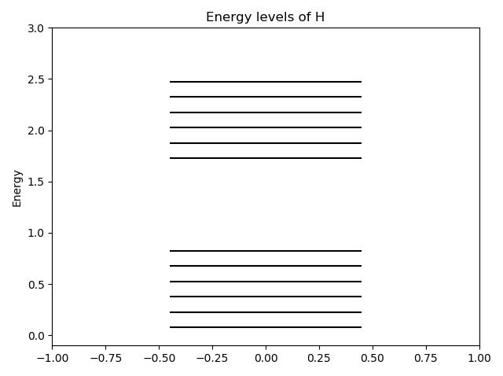
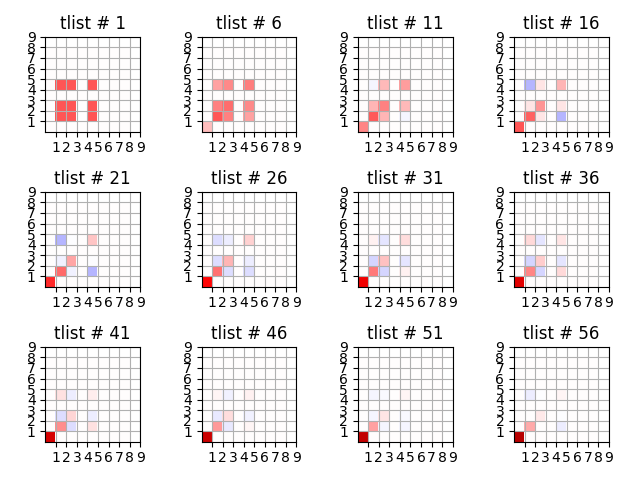
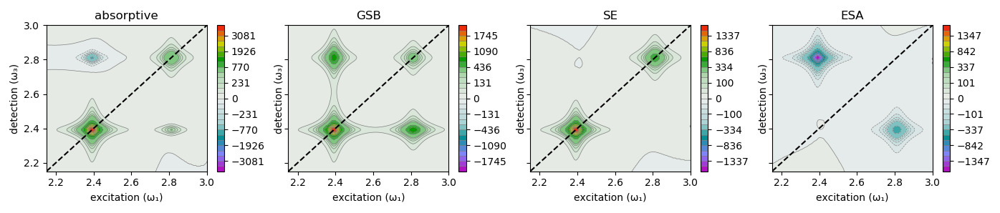
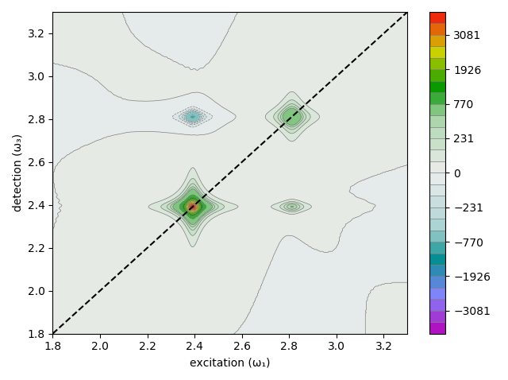

# MultidimensionalSpectroscopy.jl <!-- omit in toc -->

[](https://github.com/lbmnky/MultidimensionalSpectroscopy.jl/actions/workflows/CI.yml)
[](https://github.com/lbmnky/MultidimensionalSpectroscopy.jl/actions/workflows/TagBot.yml)
[](https://github.com/lbmnky/MultidimensionalSpectroscopy.jl/actions/workflows/CompatHelper.yml)

__Simulate coherent multidimensional spectroscopy signals from quantum mechanical models.__

*Note that examples are currently not working, due to transition from CMDS.jl to MultidimensionalSpectroscopy.jl*

*Working examples:*

- 01_coupled_dimer
- 02_displaced_harmonic_oscillator

***


## Table of contents <!-- omit in toc -->
<a name="examplesTOC"></a>

- [Introduction](#introduction)
- [Installation](#installation)
- [Function overview](#function-overview)
  - [Available functions:](#available-functions)
- [How to](#how-to)
- [Examples](#examples)
  - [The coupled dimer](#the-coupled-dimer)
  - [Displaced (harmonic) oscillators](#displaced-harmonic-oscillators)
  - [Light-matter coupled systems](#light-matter-coupled-systems)
  - [2D spectrum of J-aggregates](#2d-spectrum-of-j-aggregates)
- [Useful stuff](#useful-stuff)
  - [Evolution of density matrix](#evolution-of-density-matrix)
  - [Disentangling GSB, SE and ESA contributions](#disentangling-gsb-se-and-esa-contributions)
  - [Disentangling rephasing and non-rephasing signals](#disentangling-rephasing-and-non-rephasing-signals)
  - [Convolution with laser spectrum](#convolution-with-laser-spectrum)

***

## Introduction

The code relies primarily on [qojulia/QuantumOptics.jl](https://github.com/qojulia/QuantumOptics.jl), which is well described [here](https://docs.qojulia.org/). Further helpful examples and functionalities are found the Python project [QuTiP](http://qutip.org/).

The module [MultidimensionalSpectroscopy.jl](/src/MultidimensionalSpectroscopy.jl) contains the necessary functions to calculate 2D spectra from QM models and will be described below. [examples/](/examples) shows example scenarios.

***

## Installation

MultidimensionalSpectroscopy.jl requires the Julia language and [qojulia/QuantumOptics.jl](https://github.com/qojulia/QuantumOptics.jl), which can be installed from via the standard sources:

- [Julia](https://docs.julialang.org/en/v1/manual/getting-started/)

- [QOJulia](https://docs.qojulia.org/installation/)

Clone the repo ... and include the module via `using MultidimensionalSpectroscopy`.

***

## Function overview

Type ``?<function>`` into the REPL to access the documentation for a certain function.

### Available functions:

- __create_colormap__: creates a blue-white-green-red colormap with zero values being white (`scheme="bright"`) or dark (`scheme="dark"`)

- __zeropad__: zeropadding of time domain data before Fourier transformation into spectral domain

- __interpt__: interpolate time vector after zeropadding

- __make2Dspectra__: invokes cmds.correlations to calculate different signals

- __correlations__: calculate time evolution and interaction with laser pulses

- __view_dm_evo__: quick way to visualize evolution of density matrix

- __save_2d__: saves 2D plots to folder `fn_base`

- __plot2d__: plots 2D data in out2d

- __plot_timeTrace__: plots time traces from T evolution of 2D spectrum

- __crop2d__: crops 2D data to reduce size

- __tri__: select upper or lower triangular matrix, used to simplify pathways

- __create_subspace__: create subspace (ground state -> single excitation sector, ground state -> double excitation sector, ...) Hamiltonian and operators

- __absorptionSpectrum__: shortcut to calculate and plot absorption spectrum

- __plot2d_comps__: plot components (GSB, SE, ESA) of 2D spectrum

- __vib_analysis__: plot rephasing and non-rephasing parts of GSB, SE and ESA 2D spectra -> beating maps

- __plot_levels__: diagonalise Hamiltonian and plot level structure

***

## How to

Set up your QM model of interest!

Example (see [displaced harmonic oscillator](\examples\02_displaced_harmonic_oscillator\DHO.jl), as well as documentation of [QuantumOptics.jl](https://docs.qojulia.org/)):

```julia
b_tls = NLevelBasis(2)  # Hilbert-space of system                   Basis: {|ui⟩}
b_vib = FockBasis(5)    # Hilbert-space of oscillator               Basis: {|vi⟩}
b     = b_tls ⊗ b_vib  # combined basis

j21 = transition(b_tls,2,1) # |e⟩⟨g|
j12 = dagger(j21)           # |g⟩⟨e|
at  = create(b_vib)         # ...
a   = dagger(at)
D   = displace(b_vib,d)     # diplacement operator with the displacement d

H = ...
```

Use ``plot_levels()`` to get an overview of the energy level structure (Eigenstates) of the full systems and its components. 

```julia
plot_levels(H,0) # 0: shift in x-direction (change to display multiple energy diagrams next to each other)
```

Result: 



<a name="ordering"></a>
Operators can be ordered by increasing energy (diagonal elements of Hamiltonian) by 

```julia
idx = sortperm(real(diag((H).data)))
H.data = H.data[idx,idx]
...
```
<!---
and grouped into excitation sectors (0, 1, 2, ..., N excitations) by
-->
This is required to convert between eigen- and site basis (or coupled- and uncoupled basis) when working with a subspace of the full Hilbert space, by using the transform operator (`transf_op`) from the output of `create_subspace()` (see below):

```julia
H, transf_op, P, L, rho0, ... = create_subspace(H,"bi", L, rho0, ...)
op_site = transf_op * op  * transf_op'
```

If the dimension of the basis is too large, ``create_subspace()`` can be used to project all necessary operators into the ground + single excitation subspace (e.g. for linear spectra), or the ground + single + double excitation subspace (e.g. for 2D spectra). NOTE that creating a subspace requires ordering the operators into [excitation sectors](#ordering)

```julia
H, transf_op, P, L, ... = create_subspace([H],"bi", L, ...)
```

``...`` replaces as maybe operators is desired.


To calculate 2D spectra first initialize the output array

```julia
spectra2d = Array{out2d}(undef, length(T))
```

where `` T = [0., 5., 10., ...] `` is a vector containing population/evolution time steps.

Next call `` make2dspectra() `` in a for loop

```julia
for i = 1:length(T)
    spectra2d[i] = make2Dspectra(tlist,rho0,H,F,μ12,μ23,T[i],"lindblad";debug=false,zp=zp)
end
```

with ``tlist`` being the coherence/detection time steps, ``rho0`` the equilibrium/ground state density matrix, ``H`` the system Hamiltonian, ``F`` the jump operator (Lindblad operator) or the Redfield tensor, ``μ12`` the transition dipole operator between the ground and single excited states, and ``μ23`` the transition dipole operator between the single and double excited states. ``T[i]`` is the current population time. The option ``"lindblad"`` or ``"redfield"`` selects which ... to use. ``debug=true`` activates the debugging output and ``zp`` is the zero padding value of 10<sup>zp</sup>.

Using __multithreading__, several population time steps can be evaluated simultaneously:
```julia
Threads.@threads for i = 1:length(T)
    spectra2d[i] = make2Dspectra(...)
end
```
Make sure to disable all output plots within ``make2Dspectra()`` when using __multithreading__, as these might crash the execution.

JLD2 can be used to conveniently __save__ the ``spectra2d`` structure (does not work with cloud drives, such as pCloud). Remember to ``round2d()`` the data to save disk space.

```julia
@save "C:\\path\\to\\data\\file.jld2" out2d
```

Data can then be load as 

```julia
@load "C:\\path\\to\\data\\file.jld2" out2d
```

However, the data format is not compatible with other software. ``save2d()`` saves ASCII files for real (.re) and imaginary (.im) parts.

...

You can create a slider to flip through 2D spectra (work in progress):

```julia
using Blink, Interactive

mp = @manipulate for i in slider(1:length(spectra2d))
          clf(); plot2d(spectra2d[i].ω,spectra2d[i].full2d)
          end

w = Window(); 
body!(w, mp);
```

***

## Examples

The following examples [(scripts)](examples) are available:


<a name="coupledDimer"></a>
### The coupled dimer
[back to TOC](#examplesTOC)

[>> link](examples/01_coupled_dimer)

<a name="DO"></a>
### Displaced (harmonic) oscillators
[back to TOC](#examplesTOC)

[>> link](examples/02_displaced_harmonic_oscillator)

<!---
<a name="vibrationalCoherences"></a>
-->

<!---
<a name="FCFmorse"></a>
-->

<a name="jaynesCummings"></a>
### Light-matter coupled systems
[back to TOC](#examplesTOC)

[>> link](examples/03_systems_coupled_to_a_cavity)

<!---
<a name="ensembleDisorder"></a>
### Ensemble of two-level systems with disorder
[back to TOC](#examplesTOC)

In order to study the effect of disorder on the 2D signal [examples\ensemble_of_TLSs_w_disorder.jl](examples\ensemble_of_TLSs_w_disorder.jl) creates a composite Hamiltonian of ``num_of_TLSs`` two-level systems, whose energies are distributed by the function used to create ``disorder``. For a Gaussian distribution of energies and 5 ``num_of_TLSs = 5`` the energy diagram looks as follows:


and the relevant single excited manifold


This system leads to the following correlation function and absorption spectrum  with the Lindblad-operator ....


... and the system dynamics:


The resulting 2D spectrum is characterized by an elongated diagonal peak, and relaxation to the lowest excited state leads to sub-diagonal crosspeaks.


-->

<a name="Jaggregate"></a>
### 2D spectrum of J-aggregates
[back to TOC](#examplesTOC)

***

## Useful stuff
[back to TOC](#examplesTOC)

<a name="evolutionDensityMatrix"></a>
### Evolution of density matrix
[back to TOC](#examplesTOC)

Using ``view_dm_evo()`` you can visualize the temporal (T) evolution of the system density matrix.



<!---
<a name="tavisCummings"></a>
### Tavis-Cummings
[back to TOC](#examplesTOC)

In order to go beyond the Jaynes-Cummings model ...
-->

<a name="GSB-SE-ESA"></a>
### Disentangling GSB, SE and ESA contributions
[back to TOC](#examplesTOC)

MultidimensionalSpectroscopy.jl outputs the full2d spectrum, as well as the GSB (spectra2d.gsb), SE (spectra2d.se) and ESA (spectra2d.esa) components. These can be conveniently visualized using ``plot2d_comps(spectra2d[1])``:

<!---->

<p float="center">

</p>

As you can see, the absorptive 2D data is composed of overlapping components, which can partially cancel out. One specific example is a hetero dimer without coupling: In this case the cross-peaks are absent from the absorptive 2D data, due to the cancellation of positive GSB with negative ESA. 

<a name="R-NR"></a>
### Disentangling rephasing and non-rephasing signals
[back to TOC](#examplesTOC)

In addition, also the rephasing (spectra2d.full2d_r) and non-rephasing (spectra2d.full2d_nr) parts of the signal can be plotted. Comparison with the absorptive representation shows that the latter exhibits sharper features in the 2D spectrum. 

<p float="left">



</p>

<a name="laserConvolution"></a>
### Convolution with laser spectrum
[back to TOC](#examplesTOC)

