# MultidimensionalSpectroscopy.jl

[](https://github.com/lbmnky/MultidimensionalSpectroscopy.jl/actions/workflows/CI.yml)
[](https://github.com/lbmnky/MultidimensionalSpectroscopy.jl/actions/workflows/TagBot.yml)
[](https://github.com/lbmnky/MultidimensionalSpectroscopy.jl/actions/workflows/CompatHelper.yml)

__Simulate coherent multidimensional spectroscopy signals from quantum mechanical models.__

*Note that examples are currently not working, due to transition from CMDS.jl to MultidimensionalSpectroscopy.jl*

## Introduction

The code relies primarily on [qojulia/QuantumOptics.jl](https://github.com/qojulia/QuantumOptics.jl), which is well described [here](https://docs.qojulia.org/). Further helpful examples and functionalities are found the Python project [QuTiP](http://qutip.org/).

The module [MultidimensionalSpectroscopy.jl](/src/MultidimensionalSpectroscopy.jl) contains the necessary functions to calculate 2D spectra from QM models and will be described below. [examples/](/examples) shows example scenarios.

## Installation

MultidimensionalSpectroscopy.jl requires the Julia language and [qojulia/QuantumOptics.jl](https://github.com/qojulia/QuantumOptics.jl), which can be installed from via the standard sources:

- [Julia](https://docs.julialang.org/en/v1/manual/getting-started/)

- [QoJulia](https://docs.qojulia.org/installation/)

Clone the repo ... and include the module via `using MultidimensionalSpectroscopy`.

## MultidimensionalSpectroscopy.jl - Functions

Type ``?<function>`` into the REPL to access the documentation for a certain function.

### Available functions:

- __create_colormap__: creates a blue-white-green-red colormap with zero values being white (`scheme="bright"`) or dark (`scheme="dark"`)

- __zeropad__: zeropadding of time domain data before Fourier transformation into spectral domain

- __interpt__: interpolate time vector after zeropadding

- __make2Dspectra__: invokes cmds.correlations to calculate different signals

- __correlations__: calculate time evolution and interaction with laser pulses

- __view_dm_evo__: quick way to visualize evolution of density matrix

- __save_2d__: saves 2D plots to folder `fn_base`

- __plot2d__: plots 2D data in out2d

- __plot_timeTrace__: plots time traces from T evolution of 2D spectrum

- __crop2d__: crops 2D data to reduce size

- __tri__: select upper or lower triangular matrix, used to simplify pathways

- __create_subspace__: create subspace (ground state -> single excitation sector, ground state -> double excitation sector, ...) Hamiltonian and operators

- __absorptionSpectrum__: shortcut to calculate and plot absorption spectrum

- __plot2d_comps__: plot components (GSB, SE, ESA) of 2D spectrum

- __vib_analysis__: plot rephasing and non-rephasing parts of GSB, SE and ESA 2D spectra -> beating maps

- __plot_levels__: diagonalise Hamiltonian and plot level structure

### How to use:

Set up your QM model of interest!

Use ``plot_levels()`` to get an overview of the energy level structure (Eigenstates) of the full systems and its components. 

Operators can be ordered into excitation sectors (0, 1, 2, ..., N excitations) by
```julia
idx = sortperm(real(diag((H).data)))
H.data = H.data[idx,idx]
...
```
This helps (makes it possible) to easily convert between eigen- and site basis of the subspace, using the transform operator (`transf_op`) from the output of `create_subspace` (see below):

```julia
op_site = transf_op * op  * transf_op'
```

If the dimension of the basis is too large ``create_subspace()`` can be used to project all necessary operators into the ground + single excitation subspace (e.g. for linear spectra), or the ground + single + double excitation subspace (for 2D spectra). 

To calculate 2D spectra first initialize the output array

```julia
out2d = Array{cmds.out2d}(undef, length(T))
```

where `` T = [0., 5., 10., ...] `` is a vector containing population/evolution time steps.

Next call `` make2dspectra() `` in a for loop

```julia
for i = 1:length(T)
    spectra2d[i] = make2Dspectra(tlist,rho0,H,F,μ12,μ23,T[i],"lindblad";debug=false,zp=zp)
end
```

with ``tlist`` being the coherence/detection time steps, ``rho0`` the equilibrium/ground state density matrix, ``H`` the system Hamiltonian, ``F`` the jump operator (Lindblad operator) or the Redfield tensor, ``μ12`` the transition dipole operator between the ground and single excited states, and ``μ23`` the transition dipole operator between the single and double excited states. ``T[i]`` is the current population time. The option ``"lindblad"`` or ``"redfield"`` selects which ... to use. ``debug=true`` activates the debugging output and ``zp`` is the zero padding value of 10<sup>zp</sup>.

Using __multithreading__, several population time steps can be evaluated simultaneously:
```julia
Threads.@threads for i = 1:length(T)
    spectra2d[i] = make2Dspectra(...)
end
```
Make sure to disable all output plots within ``make2Dspectra()`` when using __multithreading__, as these might crash the execution.

JLD2 can be used to conveniently store the ``spectra2d`` structure (does not work with cloud drive, such as pCloud). Remember to ``round2d()`` the data to save disk space.

```julia
@save "C:\\path\\to\\data\\file.jld2" out2d
```

Data can be load as 

```julia
@load "C:\\path\\to\\data\\file.jld2" out2d
```

However, the data format is not compatible with other software. ``save2d()`` saves ASCII files for real (.re) and imaginary (.im) parts.

...

You can create a slider to flip through 2D spectra (work in progress):

```julia
using Blink, Interactive

mp = @manipulate for i in slider(1:length(spectra2d))
          clf(); plot2d(spectra2d[i].ω,spectra2d[i].full2d)
          end

w = Window(); 
body!(w, mp);
```

<a name="examplesTOC"></a>
## Examples

The following examples [(scripts)](/examples) are available:

- [MultidimensionalSpectroscopy.jl](#multidimensionalspectroscopyjl)
  - [Introduction](#introduction)
  - [Installation](#installation)
  - [MultidimensionalSpectroscopy.jl - Functions](#multidimensionalspectroscopyjl---functions)
    - [Available functions:](#available-functions)
    - [How to use:](#how-to-use)
  - [Examples](#examples)
    - [coupled_dimer.jl](#coupled_dimerjl)
    - [coupledDimer.jl with slightly detuned monomers and reduced coupling](#coupleddimerjl-with-slightly-detuned-monomers-and-reduced-coupling)
    - [displaced_harmonic_oscillator_model.jl](#displaced_harmonic_oscillator_modeljl)
      - [Does it wiggle?](#does-it-wiggle)
    - [FCF_morse-potential.jl](#fcf_morse-potentialjl)
    - [Jaynes-Cummings model](#jaynes-cummings-model)
    - [Ensemble of two-level systems with disorder](#ensemble-of-two-level-systems-with-disorder)
      - [Evolution of density matrix](#evolution-of-density-matrix)
    - [Tavis-Cummings](#tavis-cummings)
    - [Disentangling GSB, SE and ESA contributions](#disentangling-gsb-se-and-esa-contributions)
    - [Disentangling rephasing and non-rephasing signals](#disentangling-rephasing-and-non-rephasing-signals)
    - [Convolution with laser spectrum](#convolution-with-laser-spectrum)
    - [2D spectrum of J-aggregates](#2d-spectrum-of-j-aggregates)
    - [Coupled dimer inside a cavity](#coupled-dimer-inside-a-cavity)
    - [Tavis-Cummings with ensemble of TLSs](#tavis-cummings-with-ensemble-of-tlss)
      - [No disorder of TLSs energies](#no-disorder-of-tlss-energies)
      - [With disorder of TLSs energies](#with-disorder-of-tlss-energies)


<a name="coupledDimer"></a>
### coupled_dimer.jl
[back to TOC](#examplesTOC)

The properties (angles, coupling strength, etc.) of a coupled dimer system are calculated (see [/examples/coupled_dimer.jl](/examples/coupled_dimer.jl) for details) and QuantumOptics.jl is used to calculate the correlation function and linear absorption spectrum. The output provides the dimer geometry, distribution of the transition dipole moment strength, the system energy level scheme, the correlation function and spectrum.


CMDS.jl uses QuantumOptics.jl to calculate the 3rd-order response functions in a four-wave mixing formalism and calculates the expected 2D spectrum.


The 2D spectrum shows the ground state bleach and stimulated emission (green/yellow/red) of the ... transition on the diagonal and the excited state absorption (blue/purple) of the ... transition as the off-diagonal peak.


<a name="coupledDimerDetuned"></a>
### coupledDimer.jl with slightly detuned monomers and reduced coupling
[back to TOC](#examplesTOC)

...

Evolution during the population time leads to a decrease in signal intensity:

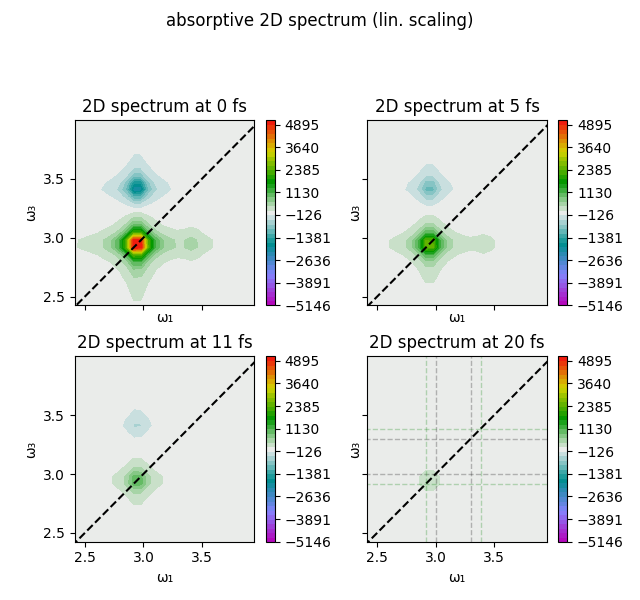

<a name="DO"></a>
### displaced_harmonic_oscillator_model.jl
[back to TOC](#examplesTOC)

Another [textbook example](chem.libretexts.org/Bookshelves/Physical_and_Theoretical_Chemistry_Textbook_Maps/Book%3A_Time_Dependent_Quantum_Mechanics_and_Spectroscopy_(Tokmakoff)/13%3A_Coupling_of_Electronic_and_Nuclear_Motion/13.01%3A_The_Displaced_Harmonic_Oscillator_Model) is the displaced oscillator (DO) model. [Here](examples/displaced_harmonic_oscillator_model.jl), two electronic levels with vibrational sub-levels are coupled and yield the correlation function and spectrum:


Again, using ``MultidimensionalSpectroscopy.jl`` we can calculate the expected 2D spectrum at ``T=0`` ...


... and its temporal evolution.


Of course, the latter is still greatly simplified.


<a name="vibrationalCoherences"></a>
#### Does it wiggle?
[back to TOC](#examplesTOC)

The following calculations were done using the [displaced oscillator](examples\displaced_harmonic_oscillator_model.jl) model. During the population time T, the diagonal elements of the density matrix are set to zero (search for keyword "XX" in ``correlations()``; will be implemented better in a future version). The following figures show the absolute value [rephasing and non-rephasing](#R-NR) 2D spectra, which are in a vibrational coherence during T:

<p float="center">


</p>

Analysis thereof potentially reveals whether a vibrational coherence "lives" on the ground or excited electronic state.

<a name="FCFmorse"></a>
### FCF_morse-potential.jl
[back to TOC](#examplesTOC)

As an intermezzo, QuantumOptics.jl can also be used to calculate Franck-Condon factors of a transition between Morse potentials:


TODO 2D with Morse potential

<a name="jaynesCummings"></a>
### Jaynes-Cummings model
[back to TOC](#examplesTOC)

The coupling between a quantized optical field and a two-level system is described by the Jaynes-Cummings Hamiltonian

H = ω<sub>r</subR-NR> a<sup>†</sup> a + ω<sub>a</sub> σ<sub>+</sub> σ<sub>-</sub> + ( a<sup>†</sup> σ<sub>-</sub> + a σ<sub>+</sub> )

or for you to copy:

```julia
H = wc * at * a + wa * sp * sm + g * (at * sm + a * sp)
```

Here, ω<sub>r</sub> is the energy/frequency/... of the cavity mode, a<sup>†</sup>(a) is the  ... and σ<sub>+</sub>(σ<sub>-</sub>)  the ... . The calculated linear absorption spectrum of the system looks pointy:


2D spectrum of the Jaynes-Cummings model at different delays of the population time T.


<a name="ensembleDisorder"></a>
### Ensemble of two-level systems with disorder
[back to TOC](#examplesTOC)

In order to study the effect of disorder on the 2D signal [examples\ensemble_of_TLSs_w_disorder.jl](examples\ensemble_of_TLSs_w_disorder.jl) creates a composite Hamiltonian of ``num_of_TLSs`` two-level systems, whose energies are distributed by the function used to create ``disorder``. For a Gaussian distribution of energies and 5 ``num_of_TLSs = 5`` the energy diagram looks as follows:

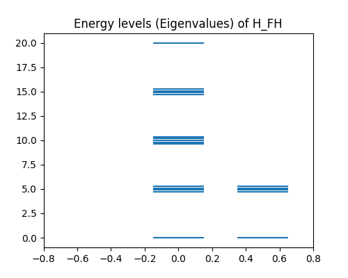

and the relevant single excited manifold

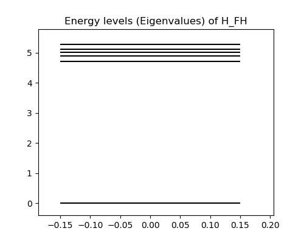

This system leads to the following correlation function and absorption spectrum  with the Lindblad-operator ....

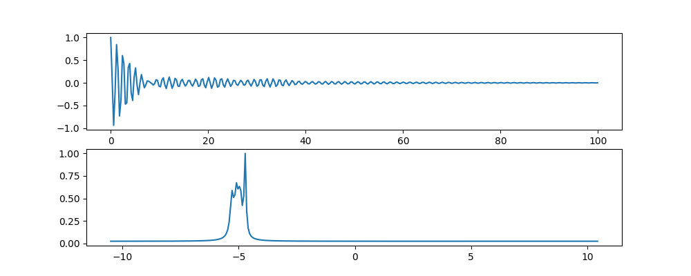

... and the system dynamics:

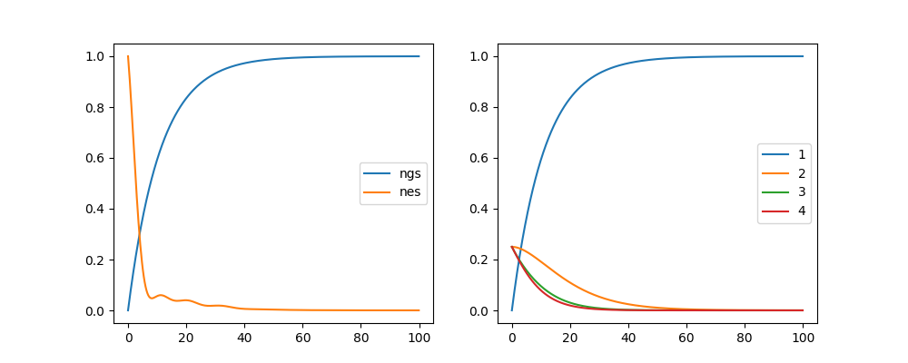

The resulting 2D spectrum is characterized by an elongated diagonal peak, and relaxation to the lowest excited state leads to sub-diagonal crosspeaks.

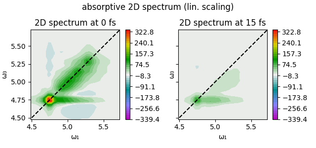

<a name="evolutionDensityMatrix"></a>
#### Evolution of density matrix
[back to TOC](#examplesTOC)

Using ``view_dm_evo()`` you can visualize the temporal (T) evolution of the system density matrix.


<a name="tavisCummings"></a>
### Tavis-Cummings
[back to TOC](#examplesTOC)

In order to go beyond the Jaynes-Cummings model ...

<a name="GSB-SE-ESA"></a>
### Disentangling GSB, SE and ESA contributions
[back to TOC](#examplesTOC)

MultidimensionalSpectroscopy.jl outputs the full2d spectrum, as well as the GSB (spectra2d.gsb), SE (spectra2d.se) and ESA (spectra2d.esa) components. These can be conveniently visualized using ``plot2d_comps(spectra2d[1])``:

<!---->

<p float="center">
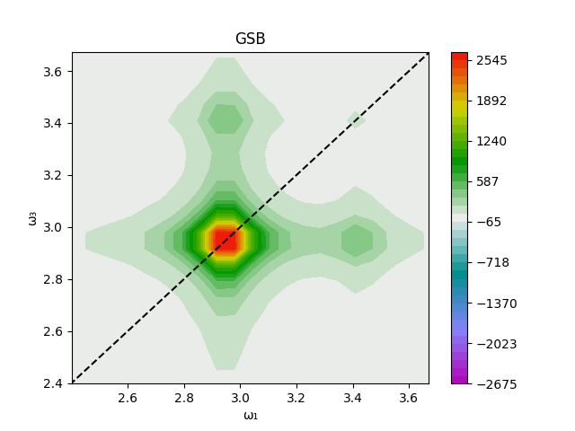
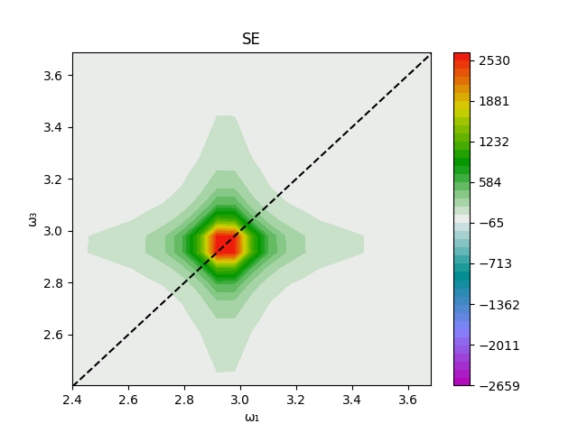
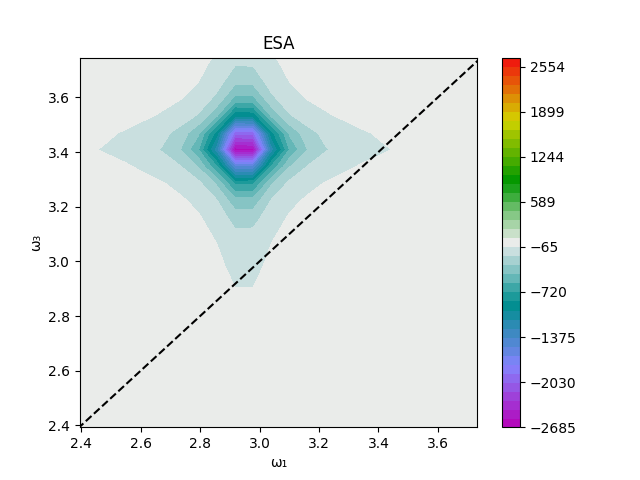
</p>

<!---->

<!---->

<a name="R-NR"></a>
### Disentangling rephasing and non-rephasing signals
[back to TOC](#examplesTOC)

In addition, also the rephasing (spectra2d.full2d_r) and non-rephasing (spectra2d.full2d_nr) parts of the signal are available:

<p float="left">
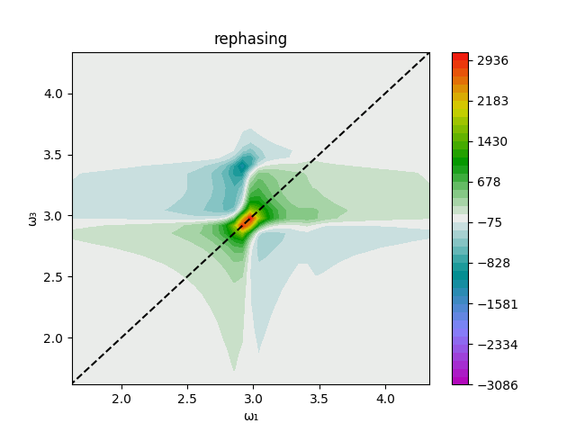
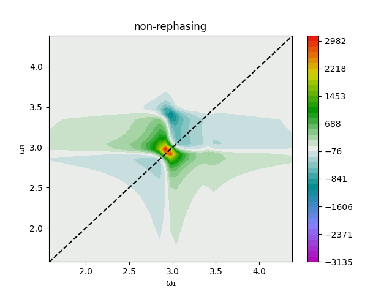
</p>

<a name="laserConvolution"></a>
### Convolution with laser spectrum
[back to TOC](#examplesTOC)


<a name="Jaggregate"></a>
### 2D spectrum of J-aggregates
[back to TOC](#examplesTOC)

<a name="coupledDimerCavity"></a>
### Coupled dimer inside a cavity
[back to TOC](#examplesTOC)

This example simulates a coupled dimer system, coupled to a cavity. The figure shows the dimer geometry (J-aggregate), the distribution of the transition dipole moment, the energy level diagram for the subsystems and the total coupled system, the populations in either of the two excited dimer states, the cavity mode, and the ground state, the correlation function and the absorption spectrum (green using a redfield master equation).

<p float="left">
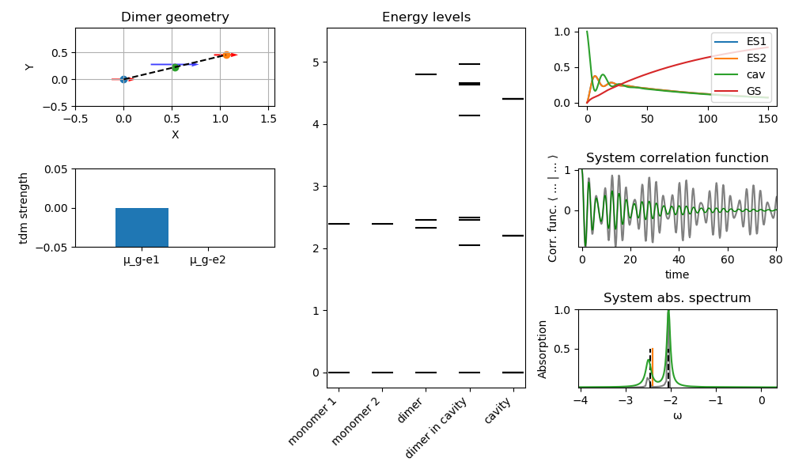
</p>

<a name="TCensemble"></a>
### Tavis-Cummings with ensemble of TLSs
[back to TOC](#examplesTOC)

#### No disorder of TLSs energies

<p float="left">
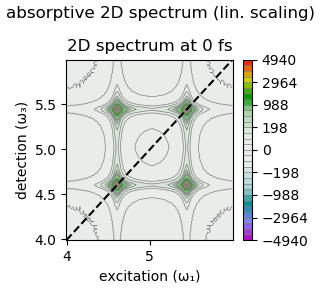
</p>

#### With disorder of TLSs energies

<p float="left">
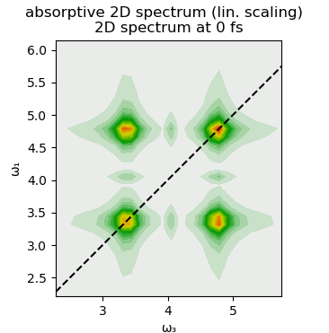

</p>

