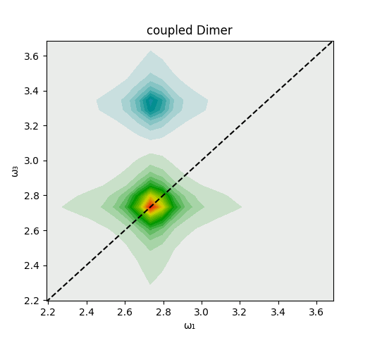

# Example "coupled dimer"

The properties (angles, coupling strength, etc.) of a coupled dimer system are calculated (see [coupled_dimer.jl](coupled_dimer.jl) for details) and QuantumOptics.jl is used to calculate the correlation function and linear absorption spectrum. The output provides the dimer geometry, distribution of the transition dipole moment strength, the system energy level scheme, the correlation function and spectrum.

CMDS.jl uses QuantumOptics.jl to calculate the 3rd-order response functions in a four-wave mixing formalism and calculates the expected 2D spectrum.

The 2D spectrum shows the ground state bleach and stimulated emission (green/yellow/red) of the ... transition on the diagonal and the excited state absorption (blue/purple) of the ... transition as the off-diagonal peak.

### coupledDimer.jl with slightly detuned monomers and reduced coupling
[back to TOC](#examplesTOC)

...

Evolution during the population time leads to a decrease in signal intensity:

