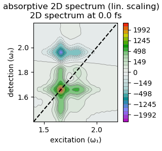
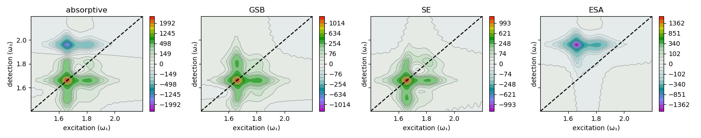
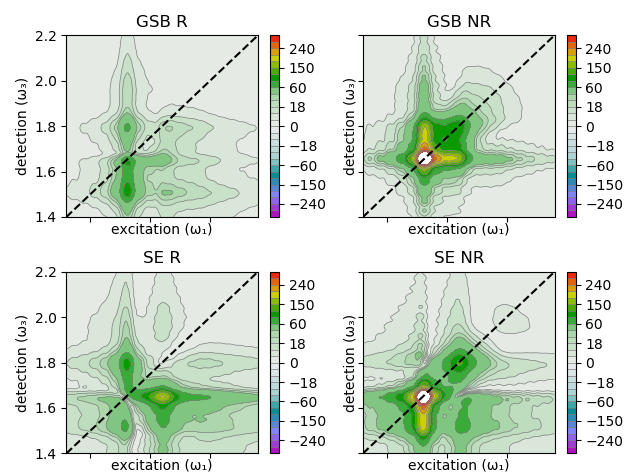
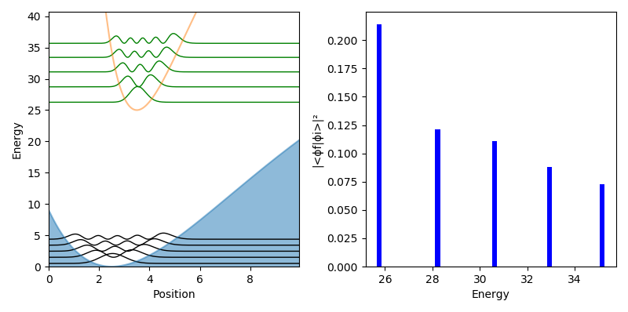

# Examples "displaced (harmonic) oscillator"

Often the behaviour of molecules can by approximated by relatively "simple" models. One approach is to describe a molecule and its vibrations by a system of displaced (harmonic) oscillators. The [theory](https://chem.libretexts.org/Bookshelves/Physical_and_Theoretical_Chemistry_Textbook_Maps/Book%3A_Time_Dependent_Quantum_Mechanics_and_Spectroscopy_(Tokmakoff)/13%3A_Coupling_of_Electronic_and_Nuclear_Motion/13.01%3A_The_Displaced_Harmonic_Oscillator_Model) involves ...

... two harmonic pontentials with vibrational levels, displaced by d ... depends on the Huang-Rhys factor S = ... 


Using MultidimensionalSpectroscopy.jl we can calculate a 2D spectrum of the DHO system with 2 electronic levels.


This 2D spectrum can be deconstructed into its GSB and SE components (ESA not present for only 2 electronic levels)


Including a third electronic level leads to the observation of ESA.





It is possible to simulate the kinetics, vibrational coherences, or both during the evolution time (T) by setting the `t2coh` flag to `"kin"`, `"vib"`, or `"full"`, respectively.
```julia
spectra2d[1] = make2Dspectra(...; t2coh="kin");
```

Modelling the vibrational coherences, allows the user to plot so-called "beating maps" via ``vib_analysis(spectra2d[1]; norm=300)`` for a system with 2 electronic states and 2 vibrational levels


... 2 electronic states and 5 vibrational levels


... and e.g. for varying Huang-Rhys factors of S = 0.5



and S = 1


It becomes apparent that the appearance of the beating maps depends strongly on the microscopic parameters of the system, such as the Huang-Rhys factor. 

#### Does it wiggle?
[back to TOC](#examplesTOC)

The following calculations were done using the [displaced oscillator](examples\displaced_harmonic_oscillator_model.jl) model. During the population time T, the diagonal elements of the density matrix are set to zero (search for keyword "XX" in ``correlations()``; will be implemented better in a future version). The following figures show the absolute value [rephasing and non-rephasing](#R-NR) 2D spectra, which are in a vibrational coherence during T:

<p float="center">


</p>

Analysis thereof potentially reveals whether a vibrational coherence "lives" on the ground or excited electronic state.

### FCF_morse-potential.jl
[back to TOC](#examplesTOC)

As an intermezzo, QuantumOptics.jl can also be used to calculate Franck-Condon factors of a transition between Morse potentials:




TODO 2D with Morse potential


<!---

Another [textbook example](chem.libretexts.org/Bookshelves/Physical_and_Theoretical_Chemistry_Textbook_Maps/Book%3A_Time_Dependent_Quantum_Mechanics_and_Spectroscopy_(Tokmakoff)/13%3A_Coupling_of_Electronic_and_Nuclear_Motion/13.01%3A_The_Displaced_Harmonic_Oscillator_Model) is the displaced oscillator (DO) model. [Here](examples/displaced_harmonic_oscillator_model.jl), two electronic levels with vibrational sub-levels are coupled and yield the correlation function and spectrum:


Again, using ``MultidimensionalSpectroscopy.jl`` we can calculate the expected 2D spectrum at ``T=0`` ...


... and its temporal evolution.


Of course, the latter is still greatly simplified.

-->
