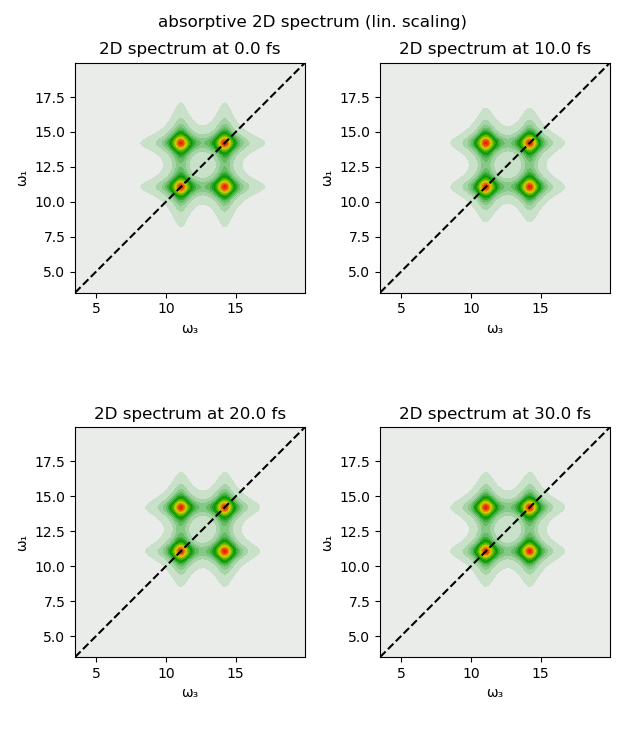
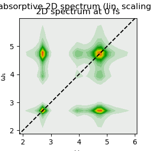
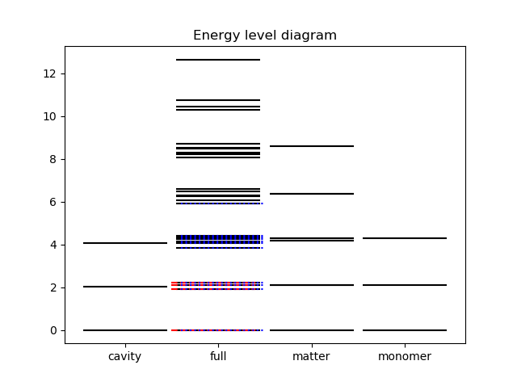
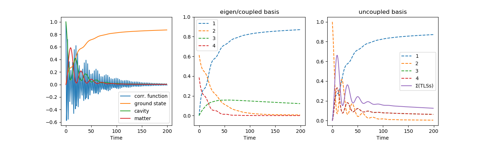
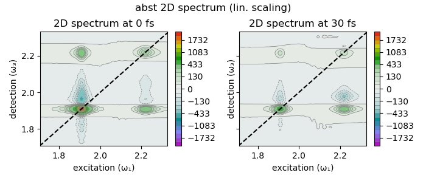
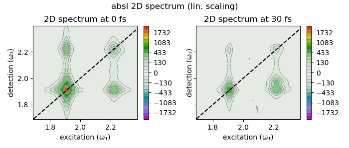

# Examples "systems coupled to cavities"

## Jaynes-Cummings model

The coupling between a quantized optical field and a two-level system is described by the Jaynes-Cummings Hamiltonian

H = ω<sub>r</subR-NR> a<sup>†</sup> a + ω<sub>a</sub> σ<sub>+</sub> σ<sub>-</sub> + ( a<sup>†</sup> σ<sub>-</sub> + a σ<sub>+</sub> )

or for you to copy:

```julia
H = wc * at * a + wa * sp * sm + g * (at * sm + a * sp)
```

Here, ω<sub>r</sub> is the energy/frequency/... of the cavity mode, a<sup>†</sup>(a) is the  ... and σ<sub>+</sub>(σ<sub>-</sub>)  the ... . The calculated linear absorption spectrum of the system looks pointy:


2D spectrum of the Jaynes-Cummings model at different delays of the population time T.




<a name="coupledDimerCavity"></a>
### Coupled dimer inside a cavity
[back to TOC](#examplesTOC)

This example simulates a coupled dimer system, coupled to a cavity. The figure shows the dimer geometry (J-aggregate), the distribution of the transition dipole moment, the energy level diagram for the subsystems and the total coupled system, the populations in either of the two excited dimer states, the cavity mode, and the ground state, the correlation function and the absorption spectrum (green using a redfield master equation).

<p float="left">

</p>

<a name="TCensemble"></a>
### Tavis-Cummings with ensemble of TLSs
[back to TOC](#examplesTOC)

#### No disorder of TLSs energies

<p float="left">

</p>

#### With disorder of TLSs energies

<p float="left">


</p>


## N TLSs in cavity

The script ``03_N_TLSs_in_cavity_w_RF.jl`` ... with the parameters found in ``parameters/A.params`` ... Shown are the energy levels of the individual and combines system(s) with the red dashed lines being included in the single-excitation manifold and the blue-dashed lines in the double-excitation manifold.



The resulting population kinetics and coherences (expectation values)



And the evolution of the 2D spectra, absorptive/real



or absolute/magnitude


